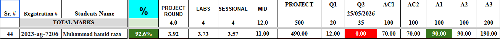
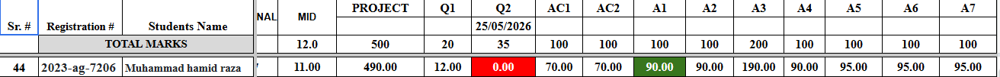
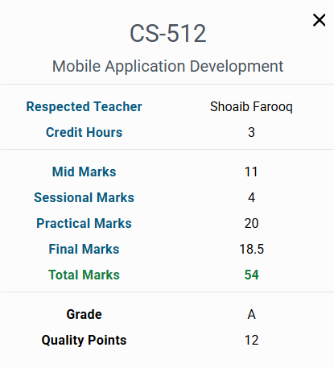

# 📱 "UAF-Mobile-App-Dev-Flutter"

> **Personal open repository** for Mobile App Development (**Flutter & Dart**) notes, lab assignments, and projects prepared by me, based on **Sir Shoaib Farooq’s lectures** at the University of Agriculture, Faisalabad (UAF).

---

## Class Evaluation Report:




---



---

## 📚 Project Overview

This repository contains **self-prepared lecture notes, lab assignments, and final project work** for the Mobile App Development course using **Flutter & Dart** taught by *Sir Shoaib Farooq* at UAF.

### 🎯 Purpose of this repository:

* 📂 Organize and preserve academic material
* 🎓 Help juniors and classmates learn Flutter development
* 📖 Provide structured reference material for revision and practice
* 🚀 Strengthen hands-on mobile app development skills

> ⚠️ **Note:** All content is self-prepared for **educational purposes only**, based on classroom learning and practice work.

---

## 📁 Repository Structure

### 📄 PDF/

Contains lecture slides, notes, and important study PDFs.

---

### 🧪 Labs/

Contains all lab assignments organized by lab number.

#### 📌 Structure Example:

```text
Labs/
 └── Lab nnn/
      ├── 2023-ag-7206.txt   → Flutter/Dart code file
      ├── 2023-ag-7206.png   → Code screenshot
      └── 2023-ag-7206.mp4   → Demo video
```

---

### 🚀 Final Project/

Contains the complete semester project.

#### 📌 Structure Example:

```text
Final Project/
 └── Project Name/
      ├── Source Code
      ├── Assets
      ├── Documentation
      └── APK / Build files
```

---

## 🚀 Why this repo exists

* 🧠 Maintain a structured record of my Flutter learning journey
* 🤝 Help juniors and classmates understand real implementations
* 📚 Provide revision support before exams and viva
* 🔁 Build consistency in mobile app development practice

---

## 📌 How to use

* 📘 Open **PDF/** → Lecture notes & study material
* 🧪 Open **Labs/** → Lab tasks, code, screenshots, and videos
* 🚀 Open **Final Project/** → Full application project
* 🎥 Use media files for better understanding of execution flow

---

## 🤝 Contributing

Friends and fellow students are welcome to contribute!

### 💡 You can help by:

* 🐛 Reporting bugs or improvements in code
* ⚡ Suggesting optimized solutions
* ✍️ Improving documentation and explanations
* 🔗 Sharing useful Flutter/Dart resources

### 📌 Guidelines:

```text
1. Fork the repository  
2. Create a new branch  
3. Make meaningful changes  
4. Submit a Pull Request  
5. Keep contributions ethical and educational  
```

---

## 📬 Contact

This repository is part of my learning journey in **Flutter development**.

Feel free to explore and use it for study purposes.

---

✨ *“Together we learn, grow, and build better applications.”*

---

### 🔗 Connect with me:

<p>
<b>For Queries Contact Me via 
<a href="https://www.linkedin.com/in/muhammad-hamid-raza-082aa62ba">LinkedIn</a>
</b>
</p>
